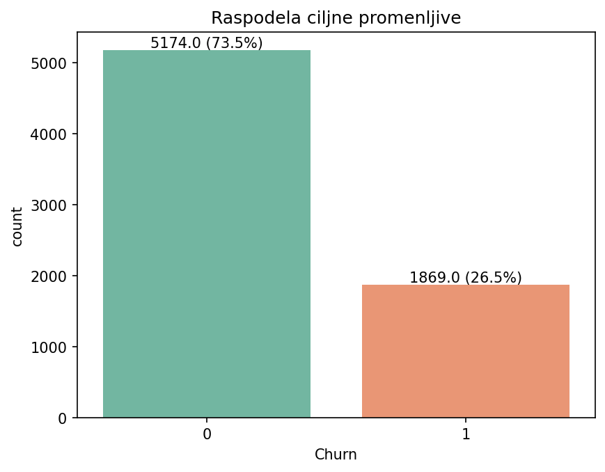
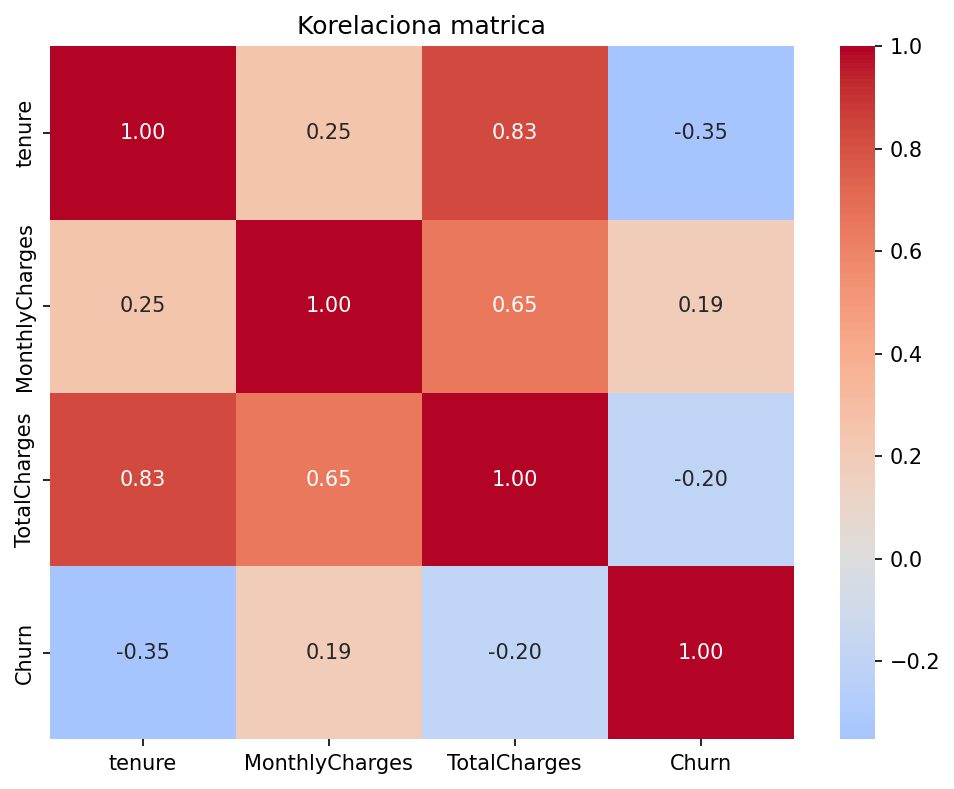
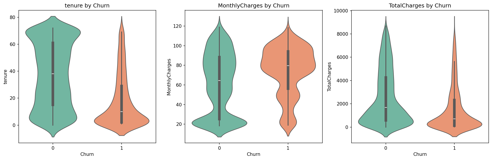
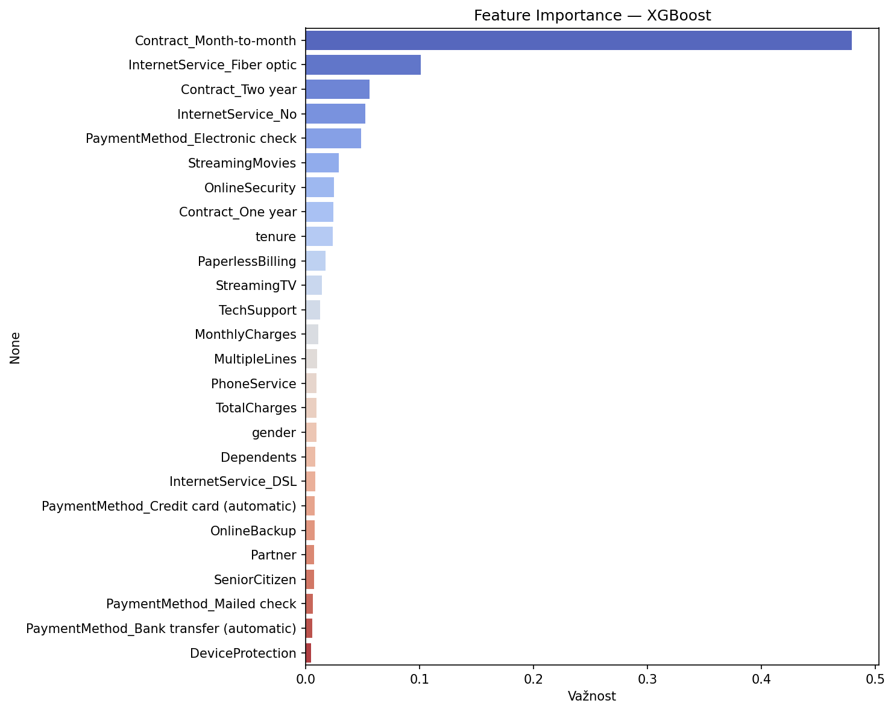
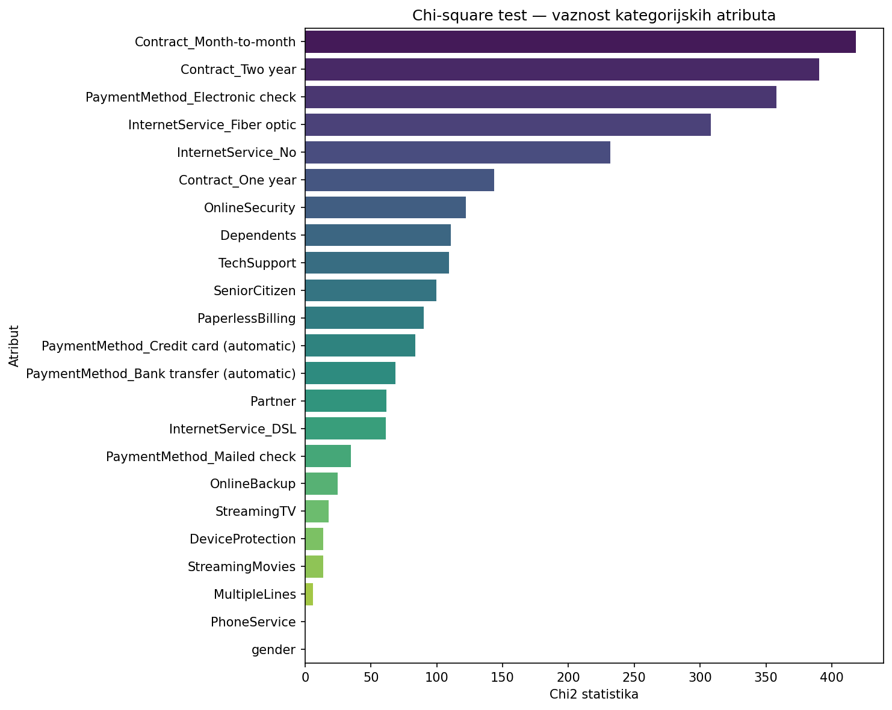
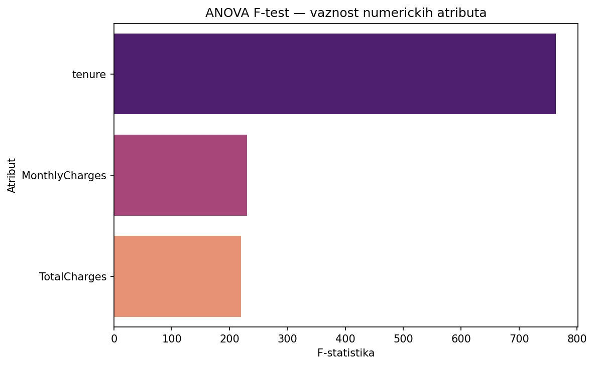

# Telco Customer Churn Classification

## Opis problema
Klasifikacioni zadatak predviđanja da li će korisnik telekomunikacione usluge 
raskinuti ugovor (churn) ili ostati (no churn), na osnovu demografskih, 
uslužnih i fakturačkih karakteristika.

## Struktura projekta

```
projekat/
├── data/
│   ├── raw/               # originalni telco_data.csv
│   └── processed/         # preprocessirani dataset
├── models/                # exportovani modeli (.pkl) i scaler
├── notebooks/
│   └── 01_eda.ipynb          # EDA, preprocessing, modelovanje
├── reports/
│   └── figures/              # grafici iz EDA i evaluacije
├── src/
│   └── churn/
│       ├── __init__.py
│       ├── preprocessing.py      # priprema i enkodiranje podataka
│       ├── model.py              # treniranje XGBoost modela
│       ├── evaluate.py           # metrike i confusion matrix
│       └── predict.py            # predikcija na novim podacima
├── app.py                # Streamlit aplikacija
├── pyproject.toml
└── README.md
```

## Postupak

### 1. Preprocessing
- Konverzija TotalCharges iz string u numerički tip (11 praznih vrednosti)
- Uklanjanje customerID kolona
- Binarno enkodiranje Yes/No kolona
- One-Hot Encoding za Contract, InternetService, PaymentMethod

### 2. EDA
- Dataset ima 7043 redova i 21 kolonu
- Ciljna promenljiva je imbalanced: 73.5% No Churn, 26.5% Churn
- Ključni nalazi:
  - Korisnici sa kraćim tenure-om češće odlaze
  - Month-to-month ugovor ima najviši churn rate
  - Fiber optic korisnici odlaze češće od DSL
  - Electronic check korisnici imaju veći churn rate (Electronic check ne uzrokuje churn, ali korisnici koji ga koriste imaju profil koji je skloniji churnu; primetiti razliku između korelacije i uzročnosti)





### 3. Modelovanje
Testirana su četiri modela:

| Model | F1 (Churn) | Recall (churn) | AUC-ROC |
|---|---|---|---|
| Logistička regresija | 0.62 | 0.79 | 0.8418 |
| Random Forest | 0.59 | 0.63 | 0.8217 |
| XGBoost | 0.60 | 0.68 | 0.8197 |
| SVM | 0.59 | 0.82 | 0.7927 |

### 4. Podešavanje hiperparametara
GridSearchCV sa 5-fold cross validation:

| Model | F1 (Churn) | Recall (churn) | AUC-ROC |
|---|---|---|---|
| Random Forest (tuned) | 0.63 | 0.78 | 0.8413 |
| XGBoost (tuned) | 0.62 | 0.79 | 0.8448 |
| SVM (tuned) | 0.62 | 0.80 | 0.8326 |

### 5. Feature Importance





Pored XGBoost feature importance urađeni i ANOVA F-test i chi-square test radi statističke potpore nalazima dobijenim sa XGBoost algoritmom. Vidimo da se statističke analize u značajnoj meri poklapaju sa XGBoost feature importance analizom.

Model sa samo 9 najvažnijih atributa postiže AUC-ROC 0.8426, što je zanemarljiva razlika u odnosu na model sa svim atributima (0.8448).

### 6. Deployment
Streamlit aplikacijom omogućen unos podataka o korisniku 
i predviđanje verovatnoće raskidanja ugovora (churn) u realnom vremenu.

## Rezultati i zaključci
- XGBoost sa podešenim hiperparametrima je najbolji model (AUC-ROC 0.8448)
- Najvažniji faktor je tip ugovora (month-to-month korisnici odlaze najčešće)
- Redukcija na 9 atributa ne utiče značajno na performanse (AUC-ROC: 0.8448 vs 0.8426), logičnije je odabrati jednostavniji model
- Dataset je imbalanced što ograničava Precision za Churn klasu (~0.51)
- Korisnici koji odlaze imaju mali TotalCharges jer su kratko bili sa kompanijom što je direktna posledica kratkog tenure-a, a ne nužno uzrok churna sam po sebi.
- Atributi nisu dovoljno "jaki", većina kolona su kategorijske Yes/No vrednosti koje nose relativno malo informacija. Nema npr. podataka o broju poziva korisničkoj službi, broju reklamacija, ili istoriji plaćanja, a to su faktori koji bi značajno poboljšali model.
- Logistička regresija daje rezultate koji su uporedivi sa složenijim modelima, što znači da su odnosi u podacima pretežno linearni.

## Preporuke za unapređenje
- Dodati više atributa (broj kontakata sa podrškom, istorija reklamacija)
- Primeniti SMOTE (tehnika za sintetičko generisanje novih Churn primera) za bolji tretman imbalanced dataseta
- Prikupiti duži vremenski period podataka

## Pokretanje aplikacije

uv run streamlit run app/app.py
